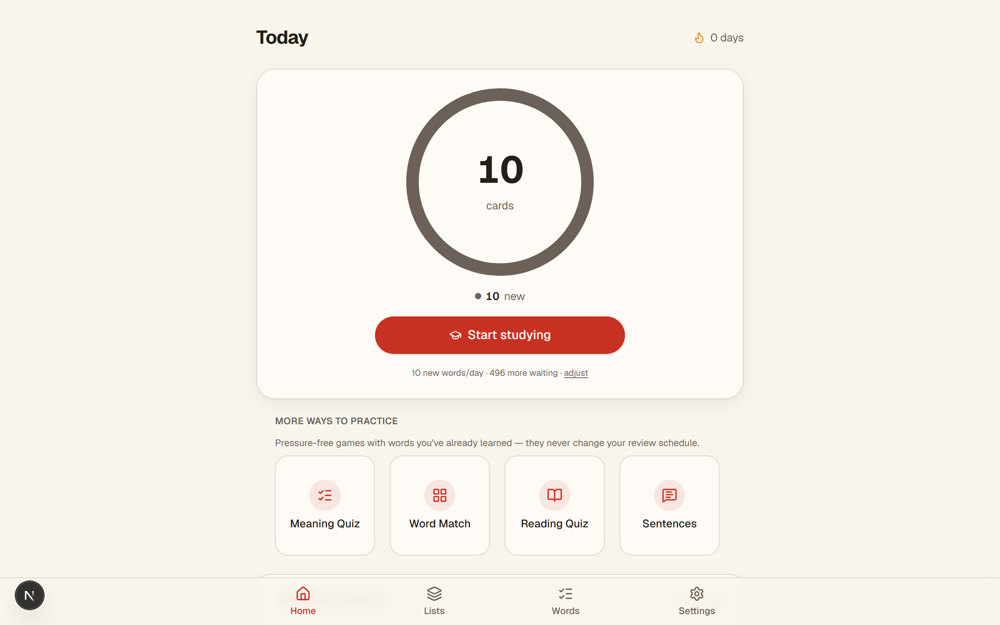
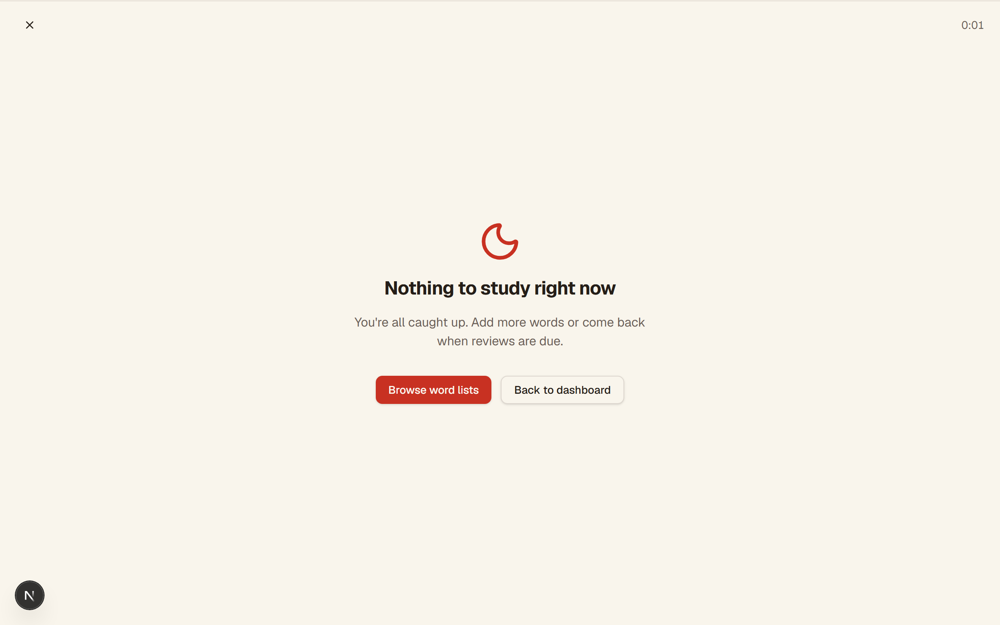
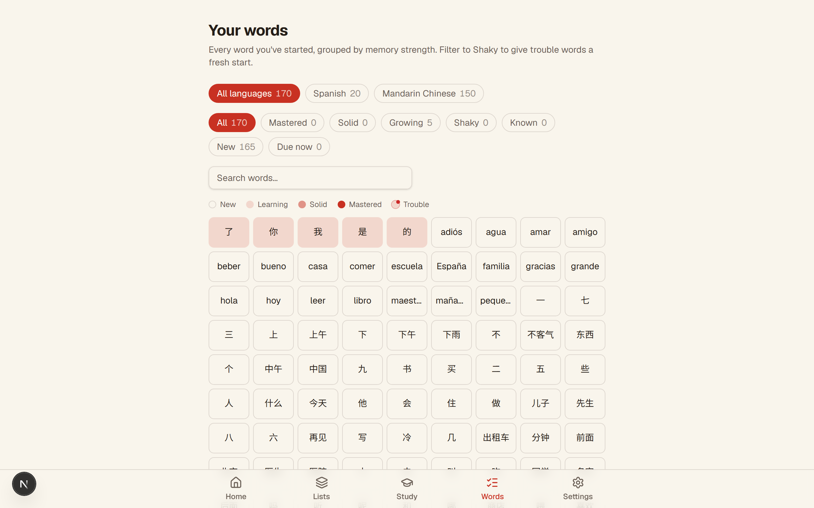
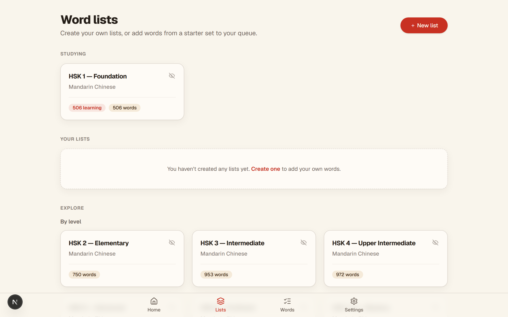

# HSK Nest

**A self-hostable spaced-repetition trainer for Mandarin — all of HSK 1–9
pre-loaded, scheduled by FSRS.**

HSK Nest helps you remember vocabulary the efficient way: a modern
memory-model schedule (FSRS) brings each word back right before you'd forget
it. The full New HSK 3.0 (2021) vocabulary — levels 1–9 — ships pre-loaded,
with 3,000 real example sentences (with pinyin) and on-device pronunciation.
Study a gesture-first swipe deck, quiz yourself four different ways, and tune
the schedule to how you learn.

Under the hood the data model is language-agnostic — anything with a term, a
meaning, and an optional reading fits — so you can import CSV decks for any
language you're memorizing.

Own your data: run it on your own server, keep everything on-device (even the
pronunciation audio), and never depend on a cloud service.

## Screenshots

|                Dashboard                 |               Study deck               |
| :--------------------------------------: | :------------------------------------: |
|  |  |

|            Word-strength browser             |              List editor               |
| :------------------------------------------: | :------------------------------------: |
|   |    |

## Features

- **Multi-language by design** — every word carries a `term`, `translation`,
  optional `phonetic`, and a free-form `metadata` JSON blob (tones, gender, part
  of speech, audio URLs, etc.), so any language fits without schema changes.
- **Your own content** — create lists, add words one at a time, or paste / CSV
  import a whole batch. Add a language inline when none fits. Edit and delete
  your own lists and words; starter lists stay read-only.
- **Paste / CSV import** — bring vocabulary in from a spreadsheet or a
  tab-separated export from other flashcard tools. Auto-detects tab vs comma,
  maps columns to term / meaning / reading, and skips blank or duplicate entries.
- **Selectable scheduling algorithms** — **FSRS** (modern memory-model
  scheduler, the default for new accounts), **SM-2** (adaptive SuperMemo 2), or
  **Leitner** (5 fixed boxes), chosen per account. Progress is stored as a
  superset, so switching never loses state.
- **Tunable schedule** — daily new-word and known-word-check caps, interval and
  lapse modifiers, a mastery cut-off, and optional interval fuzz.
- **Gesture-first study** — a full-screen card stack in a dark focus mode. Tap
  to reveal (staged), then swipe to grade. Keyboard fallback on desktop
  (← → ↑ ↓ to grade).
- **Practice modes** — beyond flashcards: a meaning quiz (pick the meaning
  from four options), a **reading quiz** (see the character, pick how it's
  read — trains symbol → sound, ideal for Chinese), matching rounds (pair up
  words and meanings from a five-word pool), and **sentence practice**
  (recognize your words inside real sentences). All pressure-free — they
  never move the review schedule.
- **Real example sentences** — 3,000 curated sentences (Tatoeba, CC-BY) with
  pinyin and translation appear on the flashcard answer and in the word
  browser, so every word is seen in context, not isolation.
- **HSK-level onboarding** — pick your level at signup and the matching deck
  is enrolled before your first review.
- **Hide-the-reading mode** — an optional per-account setting: flashcards skip
  the reading hint so you recall the pronunciation yourself; it still appears
  with the answer to check against.
- **Adjustable card text size** — small / normal / large study text, a
  per-account setting.
- **Sound effects** — subtle, dependency-free audio cues on correct grades and
  combo streaks (Web Audio, no asset files), on by default and toggleable in
  Settings.
- **Hybrid pronunciation (Pre-generated Natural TTS + Web Speech)** — plays
  high-quality, pre-generated natural audio clips (utilizing Microsoft Edge's
  Azure neural voices) served entirely from your VPS (no runtime dependencies or
  costs). Seamlessly falls back to the browser's built-in Web Speech API for custom
  words or unsupported languages. Mandarin (words + sentences) and German (words) are
  supported out of the box. An optional auto-play setting speaks each word the moment
  its reading is revealed.
- **Word-strength browser** — see every word banded by recall strength, in a
  searchable table view.
- **List priority queue** — reorder your studying lists to control where new
  words come from. Top of the stack feeds first; reviews still come from
  everywhere. Up/down controls on the lists page, no drag required.
- **Lifetime stats** — an "All time" card on the dashboard: total reviews,
  days studied, recall rate, and words-per-day pace, visible after your first
  review.
- **Focus-ring dashboard** — due counts, words learned, streak, and a 7-day
  review forecast.
- **Light / Dark / System theme** — a real account setting that follows you
  across devices, with a separate Dark focus / Match app setting for the study
  screen.
- **Study scope** — narrow a session to one language and/or specific lists; the
  choice is remembered.
- **Graded Chinese content** — the full New HSK 3.0 (2021) lists, levels 1–9,
  frequency lists (Top 100 / Top 1000 words), original everyday-conversation
  and news-reading sets, plus themed starter lists (greetings, numbers,
  family, food, colors).
- **Other languages (bonus)** — the engine is language-agnostic, so German
  (A1 essentials, a Top 100 frequency list, themed starters) and a Spanish
  starter list ship too, and you can import CSV decks for anything else. New
  accounts onboard into Mandarin; switch or add a language anytime in Settings.
- **One word, one card** — the same word appearing in several lists shares a
  single progress record: enrolling a second list skips what you already
  track, so stats and reviews never double.
- **Organized list shelf** — lists are grouped into Studying / Your lists /
  Explore, starter lists you don't want can be hidden (and restored) per
  account, and every studied word shows a strength meter with its interval.
- **Accounts & auth** — email + password via NextAuth (credentials), passwords
  hashed with bcrypt, rate-limited signup and login, soft (non-blocking) email
  verification, and self-service password reset — both via email if you
  configure Resend, or via a link logged to the server console if you don't.
- **Guest mode with upgrade** — one click on the login page creates a
  throwaway account with a starter list already enrolled, so visitors can try
  the app without signing up. Liked it? One small form turns the guest into a
  real account and keeps every word and review. Stale guests are pruned
  automatically after 14 days of inactivity.
- **Per-list progress** — every list shows how many of its words are in your
  queue, how strong they are, and how many are due right now.
- **Dictionary-assisted entry (Chinese)** — typing a Chinese word suggests
  pinyin and meaning from the bundled CC-CEDICT dictionary; one tap fills both
  fields, always editable.
- **In-app feedback** — report a bug or share an idea straight from Settings.
- **Data control** — export every word and its progress as CSV, reset progress
  for a clean slate, or delete the account entirely.

## Tech stack

- **Next.js** (App Router) + **TypeScript**
- **Tailwind CSS** + **shadcn/ui**-style primitives + **framer-motion** animations
- **Prisma ORM** with **SQLite** for local dev (swap to Postgres for production)
- **NextAuth.js** (Credentials provider, JWT sessions)
- **next-themes** for theme switching
- **Zod** for input validation
- **Vitest** for unit tests

## Quick start

Requires Node.js 18+ (Node 22 recommended).

```bash
# 1. Clone and install
git clone https://github.com/s-mberli/hsknest.git && cd hsknest
npm install

# 2. Configure environment
cp .env.example .env      # then edit: set NEXTAUTH_SECRET (`openssl rand -base64 32`)

# 3. Create the database and apply migrations
npm run db:migrate

# 4. Seed starter content (sample languages + word lists)
npm run db:seed

# 5. Run the dev server
npm run dev
```

Open [http://localhost:3000](http://localhost:3000), create an account, add or
import a word list, and start studying.

## Deploy

For self-hosting on a VPS with Docker Compose, HTTPS via a reverse proxy, and
nightly backups, see **[docs/DEPLOYMENT.md](docs/DEPLOYMENT.md)**. The short
version:

```bash
cp .env.example .env      # set NEXTAUTH_SECRET and NEXTAUTH_URL
docker compose up -d --build
```

Or skip the build and pull the prebuilt image from GHCR:

```bash
docker pull ghcr.io/s-mberli/hsknest:latest
```

The container applies migrations and seeds starter content on first boot, then
serves the standalone Next build.

## Configuration

Environment variables, per-account settings, adding system voices for audio,
and reading in-app feedback are all documented in
**[docs/CONFIGURATION.md](docs/CONFIGURATION.md)**. The data model and SRS
strategy pattern are in **[docs/ARCHITECTURE.md](docs/ARCHITECTURE.md)**.

For instructions on generating and self-hosting natural pronunciation audio clips (pre-generated using Microsoft Edge's Azure voices, mapped via client-side hashing) instead of relying on browser Web Speech, see **[docs/AUDIO.md](docs/AUDIO.md)**.

## Tests

```bash
npm test          # vitest unit suite (SRS algorithms, import parser, validation, rate limiter)
npm run test:e2e  # Playwright browser suite (signup → enroll → study → practice modes)
npm run lint      # ESLint (flat config, next/core-web-vitals + typescript)
npx tsc --noEmit  # type check
```

CI (`.github/workflows/ci.yml`) runs type check, lint, unit tests, and a
production build on every push/PR to `main`.

## Project layout

```
src/
  app/            # App Router pages + API routes
  components/     # UI primitives + study/dashboard/list components
  hooks/          # useStudySession (session + optimistic reviews)
  lib/
    srs/          # spaced-repetition strategies (FSRS, SM-2, Leitner) + registry
    import.ts     # dependency-free delimited-text parser for imports
    ownership.ts  # per-user list/language visibility rules
    validation.ts # Zod schemas for every API input
    rateLimit.ts  # in-memory fixed-window limiter (auth + feedback)
    speech.ts     # Web Speech API pronunciation wrapper
    auth.ts       # NextAuth configuration
    prisma.ts     # Prisma client singleton
prisma/
  schema.prisma   # data model
  seed.ts         # starter languages + word lists
scripts/
  screenshots.mjs # Playwright helper that captures the README screenshots
docs/
  ARCHITECTURE.md # data model + SRS strategy pattern + request flow
  AUDIO.md        # generating and self-hosting natural TTS audio clips
  CONFIGURATION.md# environment variables, settings, audio, feedback
  DEPLOYMENT.md   # VPS / Docker deploy guide + backups
```

## SRS algorithm

Scheduling is a pluggable strategy. **FSRS** (the default for new accounts),
**SM-2** (adaptive ease factor + interval), and **Leitner** (5 fixed boxes) are
all implemented in `src/lib/srs/` behind a shared interface, selectable per
account, with progress stored as a superset so switching never loses state. A
modifier layer applies interval/lapse tuning, a mastery cut-off, and optional
fuzz on top of whichever strategy is active. FSRS additionally reads a
per-account `desiredRetention` target. The schema's `srsData` JSON field and
`ReviewLog` history give each strategy room to store its own state without a
migration.

## Contributing

Bug reports and ideas are welcome — file them right from the app
(**Settings → Feedback**) or open an issue. Pull requests should keep the
existing style and pass `npm test`, `npm run lint`, and `npm run build`
(the same checks CI runs). See [CONTRIBUTING.md](CONTRIBUTING.md) for the
full guide (project rules, migration safety, scheduler proof requirements).

## License

**AGPL-3.0** — self-host freely; if you offer it as a service with your own
modifications, you must share those modifications. See [LICENSE](LICENSE) for
the full text.

The included HSK vocabulary data is MIT-licensed; see
[prisma/data/hsk/README.md](prisma/data/hsk/README.md) for attribution.
The bundled Chinese dictionary data is a trimmed build of
[CC-CEDICT](https://cc-cedict.org/wiki/) (CC BY-SA 4.0); see
[prisma/data/cedict/README.md](prisma/data/cedict/README.md). Example
sentences come from [Tatoeba](https://tatoeba.org) (CC-BY 2.0 FR), with
per-sentence attribution stored alongside each entry. The app also shows
these credits at `/credits`.

## Roadmap

**Shipped (v0.1 MVP):** multi-language schema · SM-2 + Leitner (selectable) ·
staged-reveal study with gesture + keyboard grading · daily new/review caps +
session sizing · algorithm tuning (interval/lapse modifiers, mastery, fuzz) ·
assumed-known + daily checks · weak-word triage · word-strength browser ·
focus-ring dashboard + 7-day forecast · CSV/paste import · user-created lists &
words · Light/Dark/System theme + study-screen focus setting · study-scope
filtering · graded HSK + original Chinese lists · CSV export · progress
reset · on-device pronunciation · security hardening (rate limits, input caps,
headers) · in-app feedback · Docker + compose self-host packaging ·
multiple-choice quiz + matching-pairs practice modes · card text sizing ·
Playwright end-to-end suite · guest mode with account upgrade + stale-guest
pruning · account deletion · per-list progress chips · CC-CEDICT
dictionary-assisted word entry (Chinese) · session summary with toughest
words + re-study · FSRS as a third scheduling strategy · email verification +
password reset / account recovery flow · full HSK 1–9 (2021) decks ·
3,000 Tatoeba example sentences with pinyin · sentence-practice mode ·
new-word preview flow (see it once before it's graded) · HSK-level
onboarding with deck auto-enroll · auto-play pronunciation setting ·
hosted-plan billing (Stripe, fully bypassed when self-hosting via
`SELF_HOSTED=true`) · cookieless analytics hooks (Umami, opt-in via env) ·
list priority queue (reorder studying lists to control new-word source) ·
lifetime stats card (reviews, days studied, recall rate, pace) · hybrid pronunciation engine (pre-generated Azure neural TTS for Mandarin and German with client Web Speech fallback) · card deck spacebar shortcuts for previews · sentence practice mode enhancements (pinyin display and audio replay button).

**Next (v0.2):**

- Study reminders / schedule — a calendar of upcoming reviews with optional
  notifications
- More practice modes: type-the-answer (phonetic-aware for Chinese) and a
  picture quiz with generated images
  (pronunciation quiz + hide-reading mode + practice/refresh mode shipped)
- Per-element card text controls (character / phonetic / meaning sizes)
- Speaking-practice mode — say the word aloud and get graded by speech
  recognition (a distinct study mode)
- Bring-your-own-key integrations: cloud TTS and image generation via your own
  API key (server proxy, encrypted per-user key storage; instance operators can
  set global keys; features hide when no provider is configured)
- 4-click response mode (separate pronunciation vs meaning grading) as a setting
- Suspend/block words (never schedule)
- Review heatmap / streak calendar; per-list success and learning curve

**Later (v1.0+):**

- PostgreSQL option for horizontal scaling
- Feedback admin dashboard
- PWA + installable mobile app with offline queue and idempotent batch sync
- AI example-sentence generation from known vocabulary (`metadata` reserved)
- Shared/public user lists + community library
- Per-list progress stats (mastery breakdown, completion, due counts)
- Dictionary-style word detail pages (components, example sentences, frequency)
- Hosted managed instance (paid, free trial) for those who'd rather not
  self-host, with per-account quotas on costly features
