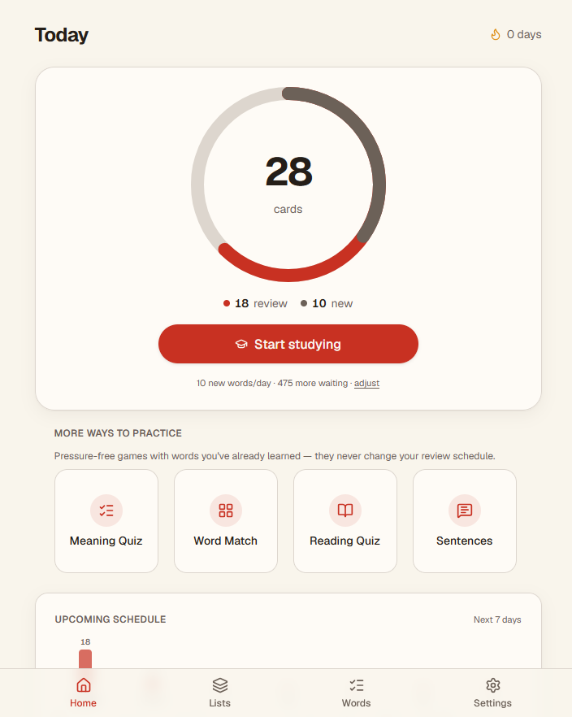
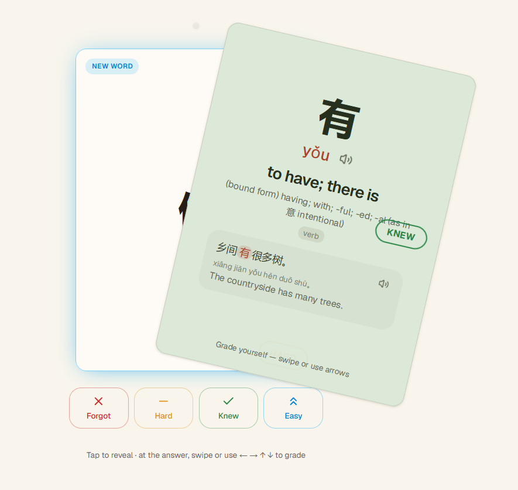
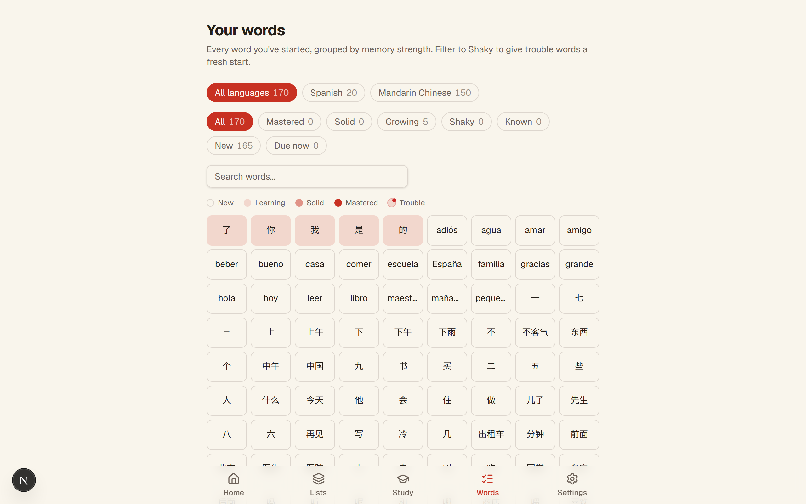
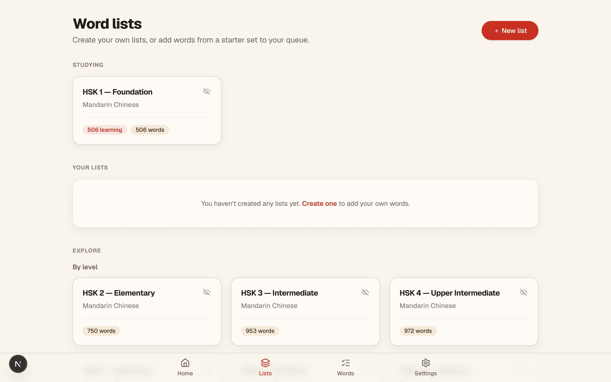

# 🪹 HSK Nest

[](https://github.com/s-mberli/hsknest/actions/workflows/ci.yml)
[](https://github.com/s-mberli/hsknest/packages)
[](https://www.gnu.org/licenses/agpl-3.0)

> A self-hostable, FSRS-powered flashcard trainer built for serious language learners. Mandarin-first out of the box, language-agnostic under the hood.

HSK Nest is an open-source, self-hostable flashcard app that uses the state-of-the-art FSRS memory model to schedule reviews exactly when you're about to forget. 

It ships Mandarin-first — the complete New HSK 3.0 vocabulary (levels 1–9), 3,000 real-world example sentences with pinyin, dictionary-assisted entry, and natural Azure neural TTS served entirely from your own server. The scheduling engine is language-agnostic, so you can import CSV decks for anything else (German and Spanish starters are bundled).

Own your data. Run it on your VPS. No subscriptions, no telemetry, no lock-in.

> 🚀 **Want to use HSK Nest without setting up a server?** Try our managed cloud version. 14-day free trial, then just €10/month.<br>
> 👉 **[Visit hsknest.com to sign up](https://hsknest.com)**
>
> *Prefer to self-host? Keep reading! 100% open-source under AGPL-3.0.*

## Contents

- [Why HSK Nest?](#why-hsk-nest)
- [Highlights](#highlights)
- [Screenshots](#screenshots)
- [How it compares](#how-it-compares)
- [Quick start](#quick-start)
- [Self-hosting](#self-hosting)
- [Bring your own vocabulary](#bring-your-own-vocabulary)
- [Features](#features)
- [Tech stack](#tech-stack)
- [Project layout](#project-layout)
- [Roadmap](#roadmap)
- [Contributing](#contributing)
- [Credits](#credits)
- [License](#license)

## Why HSK Nest?

- 🧠 **State-of-the-art scheduling** — FSRS by default (with SM-2 & Leitner options), switchable per-account without losing progress.
- 🇨🇳 **Mandarin-first content** — Full New HSK 3.0 (levels 1–9), 3,000 Tatoeba sentences with pinyin, and CC-CEDICT dictionary assist.
- 🏠 **Truly self-hostable** — Your data, your VPS, your audio. No subscription lock-in. AGPL-3.0 licensed.
- 🔊 **Natural on-device pronunciation** — Pre-generated Azure neural TTS served locally, with Web Speech API fallback for custom words.

## Highlights
	
| Feature | Description |
|---|---|
| 🧠 | **FSRS / SM-2 / Leitner** — Pluggable scheduling strategies, switchable per-account. |
| 🇨🇳 | **Mandarin-first** — Full New HSK 3.0 (1–9) + 3,000 example sentences with pinyin. |
| 👆 | **Gesture-first swipe deck** — Full-screen dark focus mode with keyboard fallback. |
| 🔊 | **Hybrid TTS** — Pre-generated Azure neural clips served locally + Web Speech fallback. |
| 📥 | **CSV / paste import** — Bring vocabulary from spreadsheets or other flashcard tools. |
| 🐳 | **One-command Docker** — Simple self-hosting with automated migrations and seeding. |
| 🌗 | **Light / Dark / System themes** — Plus a dedicated dark focus mode for studying. |
| 🔐 | **Accounts & Data Control** — Email auth, full data export/deletion. Guest trials on the hosted version. |

## Screenshots

| Dashboard | Study deck |
| :---: | :---: |
|  |  |

| Word-strength browser | List editor |
| :---: | :---: |
|  |  |

## How it compares

| Feature | HSK Nest | Anki | Mochi | RemNote |
|---|---|---|---|---|
| FSRS by default | ✅ | ⚠️ (addon) | ❌ | ❌ |
| Fully self-hostable | ✅ | ⚠️ (sync only) | ❌ | ❌ |
| Mandarin-first content | ✅ | ⚠️ (find decks) | ❌ | ❌ |
| On-device natural TTS | ✅ | ❌ | ❌ | ❌ |
| Modern web UX | ✅ | ❌ | ✅ | ✅ |
| Open source | ✅ AGPL | ✅ AGPL | ❌ | ❌ |

## Quick start

**TL;DR (Docker):**

```bash
docker run -d -p 3000:3000 -v hsknest-data:/data ghcr.io/s-mberli/hsknest:latest
```

**Full local development:**
Requires Node.js 18+ (Node 22 recommended).

```bash
# 1. Clone and install
git clone https://github.com/s-mberli/hsknest.git && cd hsknest
npm install

# 2. Configure environment
cp .env.example .env      # then edit: set NEXTAUTH_SECRET (`openssl rand -base64 32`)

# 3. Create the database and apply migrations
npm run db:migrate

# 4. Seed starter content (sample languages + word lists)
npm run db:seed

# 5. Run the dev server
npm run dev
```

Open http://localhost:3000, create an account, add or import a word list, and start studying.

## Self-hosting

For self-hosting on a VPS with Docker Compose, HTTPS via a reverse proxy, and nightly backups, see `docs/DEPLOYMENT.md`. 

### Docker Compose (recommended)

```bash
cp .env.example .env      # set NEXTAUTH_SECRET and NEXTAUTH_URL
docker compose up -d --build
```

### Docker run (quick start, no compose)

```bash
docker run -d \
  -p 3000:3000 \
  -v hsknest-data:/data \
  ghcr.io/s-mberli/hsknest:latest
```

The container will:
- Auto-generate a `NEXTAUTH_SECRET` and persist it to `/data/.nextauth-secret` (survives restarts)
- Auto-seed starter content (HSK vocabulary + lists) on first boot
- Apply any pending database migrations
- Serve the app at `http://localhost:3000`

Visit `http://localhost:3000`, create an account, and start studying. Your data lives entirely in the `hsknest-data` volume.

**Registration closes after your first account** — it claims the instance, and
signup/guest-mode turn off automatically so a network-reachable container
can't hand out free accounts to strangers. Set `ALLOW_REGISTRATION=true` to
reopen both (e.g. for a household member); see `docs/CONFIGURATION.md`. If the
data volume is ever lost or unmounted, the app sees zero accounts and reopens
registration — your original data is unaffected, but treat the volume as the
thing to back up.

## Bring your own vocabulary

HSK Nest ships Mandarin-first, but the engine is language-agnostic — **add any language yourself in about ten seconds**, no config files, no restart, no schema changes:

**Lists → New list → Language → “+ new language”** → name it (`Japanese` / `ja`) and start adding words.

Vocabulary goes in as plain comma- or tab-separated text — paste straight from a spreadsheet, or from **Anki** via *File → Export → “Notes in Plain Text”*:

```
你好,hello,nǐ hǎo
谢谢,thank you,xiè xie
```

Because the format is plain text, you can have an LLM build a deck for you — **[docs/IMPORT.md](docs/IMPORT.md) includes a copy-paste prompt** for generating a word list in any language, along with the full format spec, limits, and troubleshooting.

Your own language gets the full scheduler and every study mode. It won't have pre-generated Azure audio, dictionary assist, or graded level lists — those are Mandarin-specific (German and Spanish ship starter lists). Browser text-to-speech still works for any language your OS has a voice for.

## Features

### Content & Import

- **Multi-language by design** — Every word carries a term, translation, optional phonetic, and free-form metadata (tones, gender, part of speech, etc.). Any language fits without schema changes.
- **Your own content** — Create lists, add words one at a time, or paste/CSV import a whole batch. Add a language inline when none fits.
- **Paste / CSV import** — Auto-detects tab vs comma, maps columns to term/meaning/reading, and skips blank or duplicate entries. Full spec and an AI deck-generation prompt in [docs/IMPORT.md](docs/IMPORT.md).
- **Real example sentences** — 3,000 curated sentences (Tatoeba, CC-BY) with pinyin and translation appear on flashcards and in the word browser.
- **Graded Chinese content** — Full New HSK 3.0 (2021) lists levels 1–9, frequency lists (Top 100/1000), original everyday-conversation and news-reading sets, plus themed starters.
- **Dictionary-assisted entry (Chinese)** — Typing a Chinese word suggests pinyin and meaning from the bundled CC-CEDICT dictionary.

### Study & Practice

- **Gesture-first study** — A full-screen card stack in a dark focus mode. Tap to reveal, swipe to grade. Keyboard fallback on desktop (← → ↑ ↓).
- **Practice modes** — Meaning quiz, reading quiz (symbol → sound), matching rounds (pair words/meanings), and sentence practice. All pressure-free—they never move the review schedule.
- **Hide-the-reading mode** — Flashcards skip the reading hint so you recall pronunciation yourself; it still appears with the answer.
- **Sound effects** — Subtle, dependency-free Web Audio cues on correct grades and streaks (toggleable).
- **Hybrid pronunciation** — High-quality, pre-generated Azure neural TTS clips served locally. Falls back to browser Web Speech API for custom words. Mandarin (words + sentences) and German (words) supported out of the box.
- **Adjustable card text size** — Small / normal / large study text, per-account.
- **Study scope** — Narrow a session to one language and/or specific lists; the choice is remembered.

### Scheduling & Progress

- **Selectable algorithms** — FSRS (default), SM-2 (adaptive ease factor), or Leitner (5 fixed boxes). Progress is stored as a superset, so switching never loses state.
- **Tunable schedule** — Daily new-word and known-word-check caps, interval/lapse modifiers, mastery cut-off, and optional interval fuzz.
- **Word-strength browser** — See every word banded by recall strength in a searchable table.
- **List priority queue** — Reorder studying lists to control where new words come from. Reviews still come from everywhere.
- **Lifetime stats** — Total reviews, days studied, recall rate, and words-per-day pace.
- **Focus-ring dashboard** — Due counts, words learned, streak, and a 7-day review forecast.
- **One word, one card** — The same word in several lists shares a single progress record. Stats and reviews never double.

### Account & System

- **HSK-level onboarding** — Pick your level at signup and the matching deck is enrolled before your first review.
- **Accounts & auth** — Email + password via NextAuth, bcrypt hashing, rate-limited signup/login, soft email verification, and self-service password reset.
- **Guest mode with upgrade** — One click creates a throwaway account with a starter list. Liked it? One small form turns the guest into a real account and keeps all data. Hosted only; on a self-hosted instance it stays off unless you set `ALLOW_REGISTRATION=true`.
- **Light / Dark / System theme** — A real account setting that follows you across devices.
- **Organized list shelf** — Lists grouped into Studying / Your lists / Explore. Hide starter lists you don't want.
- **Data control** — Export every word and its progress as CSV, reset progress, or delete the account entirely.
- **In-app feedback** — Report a bug or share an idea straight from Settings.

## Tech stack

- **Framework**: Next.js (App Router) + TypeScript
- **Styling**: Tailwind CSS + shadcn/ui-style primitives + framer-motion
- **Database**: Prisma ORM with SQLite, including in production (single-file, backed up nightly; Postgres is schema-swappable in principle but untested — SQLite is what actually runs hsknest.com)
- **Auth**: NextAuth.js (Credentials provider, JWT sessions)
- **Validation**: Zod
- **Testing**: Vitest (unit) + Playwright (E2E)

## Project layout

```text
src/
  app/            # App Router pages + API routes
  components/     # UI primitives + study/dashboard/list components
  hooks/          # useStudySession (session + optimistic reviews)
  lib/
    srs/          # spaced-repetition strategies (FSRS, SM-2, Leitner) + registry
    import.ts     # dependency-free delimited-text parser for imports
    ownership.ts  # per-user list/language visibility rules
    validation.ts # Zod schemas for every API input
    rateLimit.ts  # in-memory fixed-window limiter (auth + feedback)
    speech.ts     # Web Speech API pronunciation wrapper
    auth.ts       # NextAuth configuration
    prisma.ts     # Prisma client singleton
prisma/
  schema.prisma   # data model
  seed.ts         # starter languages + word lists
scripts/
  screenshots.mjs # Playwright helper that captures the README screenshots
docs/
  ARCHITECTURE.md # data model + SRS strategy pattern + request flow
  AUDIO.md        # generating and self-hosting natural TTS audio clips
  CONFIGURATION.md# environment variables, settings, audio, feedback
  IMPORT.md       # CSV/TSV format spec, AI deck generation, new languages
  DEPLOYMENT.md   # VPS / Docker deploy guide + backups
```

For more details on the SRS algorithm, data model, and configuration options, check the `docs/` directory.

## Roadmap

See **[RELEASES.md](RELEASES.md)** for the full roadmap, release notes, and roadmap priorities.

TL;DR: **Unreleased** tracks confirmed bugs and next-ship features; **Someday** is a flexible pool of ideas. No artificial milestones, just clear tracking as a solo dev.

## Contributing

Bug reports and ideas are welcome — file them right from the app (**Settings → Feedback**) or open an issue. Pull requests should keep the existing style and pass `npm test`, `npm run lint`, `npm run build`, and `npm run test:e2e` (the same checks CI runs, across two jobs). 

See `CONTRIBUTING.md` for the full guide (project rules, migration safety, scheduler proof requirements).

## Credits

HSK Nest wouldn't be possible without the open-source language learning community:

- **Example sentences:** Tatoeba (CC-BY 2.0 FR)
- **Chinese dictionary:** CC-CEDICT (CC BY-SA 4.0)
- **Vocabulary data:** New HSK 3.0 lists (MIT-licensed, see `prisma/data/hsk/README.md`)

The app shows these credits in-detail at `/credits`.

## License

The HSK Nest application code is licensed under **AGPL-3.0**. Self-host freely; if you offer it as a service with your own modifications, you must share those modifications. See LICENSE for the full text.

Bundled data carries separate licenses:

| Component | License |
|---|---|
| Application code | AGPL-3.0 |
| HSK vocabulary data | MIT |
| CC-CEDICT dictionary (trimmed) | CC BY-SA 4.0 |
| Example sentences (Tatoeba) | CC BY 2.0 FR |

---

⭐ **If HSK Nest helps you, please star the repo — it helps others find it!**
